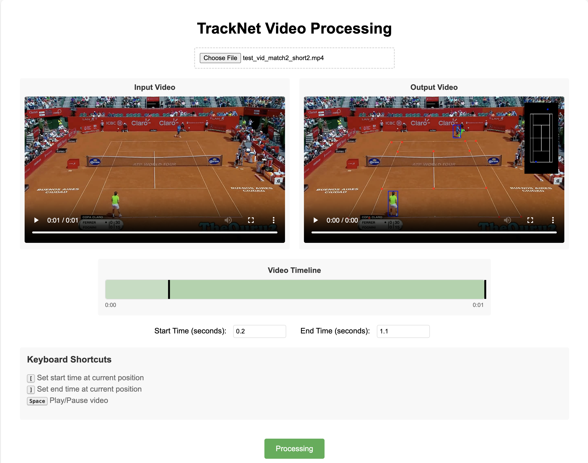
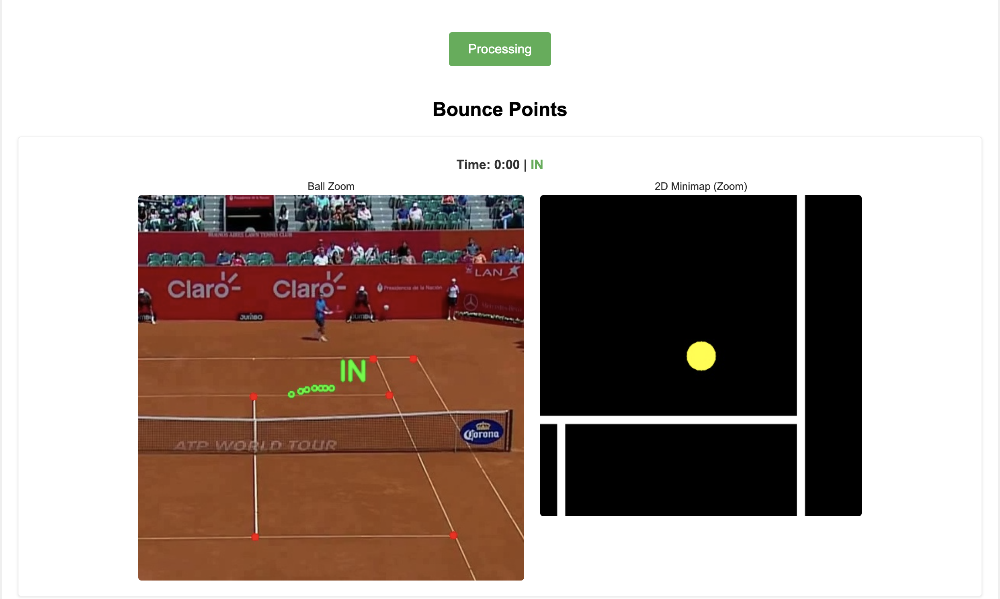

# Tennis Ball Tracking 

This project implements a computer vision-based pipeline to track a tennis ball during gameplay and detect bounce events using TrackNet-deep learning and machine learning techniques.

## How to Run

### 1. Prepare the Input
Make sure you have a video file in **1280x720 resolution**. Other resolutions are not currently supported and may lead to incorrect results.

### 2. Clone the Repository
```bash
git clone https://github.com/QuangHoangNguci/TrackNet_project.git
cd TrackNet_project
```
### 3. install Dependencies
Make sure you have Python 3.8+ installed. In this project, I used python 3.8.20.
```bash
pip install -r requirements.txt
```
### 4. Run the Application
```bash
python main.py \
  --path_ball_track_model <path>/model_best.pt \
  --path_court_model <path>/model_tennis_court_det.pt \
  --path_bounce_model <path>/bounce_detection_weights.cbm \
  --path_input_video <path>/test_vid_match2_short2.mp4 \
  --path_output_video <path>.avi
```

### 5. Run webapp
```bash
python app.py
```


